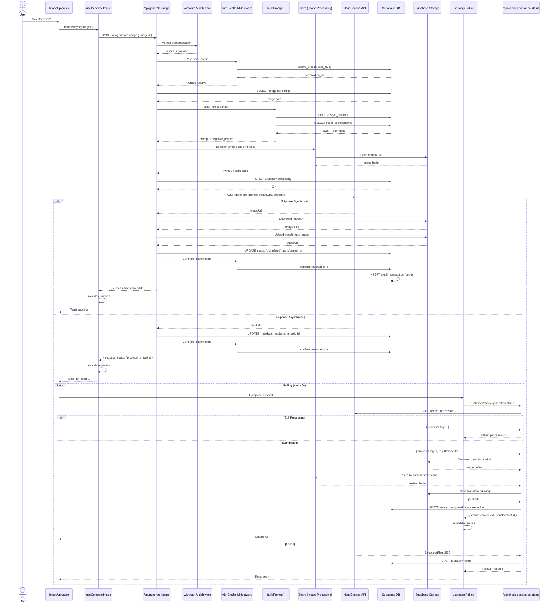

# Analyse Forensique Complète : Flux de Génération d'Image

**Application**: Renzo Immo (Next.js 14 + Supabase + NanoBanana AI)  
**Date d'analyse**: 2025-11-05  
**Version**: Production-ready

---

## Table des Matières

1. [Vue d'ensemble du flux](#1-vue-densemble-du-flux)
2. [Point de départ - Interface utilisateur](#2-point-de-départ---interface-utilisateur)
3. [Hooks React Query](#3-hooks-react-query)
4. [API Routes](#4-api-routes)
5. [Middlewares](#5-middlewares)
6. [Services Backend](#6-services-backend)
7. [Repositories et Storage](#7-repositories-et-storage)
8. [Système de Prompts](#8-système-de-prompts)
9. [Services Externes (NanoBanana)](#9-services-externes-nanobanana)
10. [Système de Polling](#10-système-de-polling)
11. [Gestion des Crédits](#11-gestion-des-crédits)
12. [Schéma de Base de Données](#12-schéma-de-base-de-données)
13. [Variables d'Environnement](#13-variables-denvironnement)
14. [Diagramme de Séquence Complet](#14-diagramme-de-séquence-complet)

---

## 1. Vue d'ensemble du flux

### Flux Simplifié

```
User Click "Générer" 
  ↓
ImageUploader Component (configuration)
  ↓
useUploadImage Hook (React Query)
  ↓
ManageImagesService.uploadImage()
  ↓
Supabase Storage (original image)
  ↓
SupabaseImagesRepository.createImage() (status: pending)
  ↓
User Click "Generate" on Image Card
  ↓
useGenerateImage Hook
  ↓
POST /api/generate-image
  ↓
withAuth Middleware (authentication)
  ↓
withCredits Middleware (reserve 1 credit)
  ↓
generateImageHandler()
  ↓
buildPrompt() (modular prompt system)
  ↓
NanoBanana API (async generation)
  ↓
[IF SYNC] → Direct URL → Supabase Storage → status: completed
[IF ASYNC] → taskId saved → status: processing → Polling starts
  ↓
useImagePolling Hook (every 5s)
  ↓
POST /api/check-generation-status
  ↓
NanoBanana Status Check API
  ↓
[When completed] → Download → Resize → Supabase Storage → status: completed
  ↓
React Query invalidation → UI update
```

### Technologies Utilisées

- **Frontend**: Next.js 14 (App Router), React 18, TypeScript
- **State Management**: React Query (TanStack Query)
- **Backend**: Next.js API Routes (Server Components)
- **Database**: Supabase (PostgreSQL)
- **Storage**: Supabase Storage
- **AI Provider**: NanoBanana API
- **Image Processing**: Sharp (server-side)
- **Authentication**: Supabase Auth
- **Rate Limiting**: Upstash Redis
- **Error Tracking**: Sentry

---

## 2. Point de départ - Interface utilisateur

### 2.1 Page Projet

**Fichier**: `app/dashboard/projects/[id]/page.tsx`  
**Lignes**: 1-577

#### Responsabilités
- Affiche un projet et ses images
- Gère l'upload de nouvelles images
- Déclenche la génération d'images
- Gère le polling des images en cours

#### Code clé

```typescript
// Ligne 8: Import du hook de génération
import { useGenerateImage } from "@/modules/images";

// Ligne 73: Instanciation du hook
const generateImageMutation = useGenerateImage();

// Lignes 480-492: Déclenchement de la génération
onGenerate={async (imageId) => {
  setGeneratingImageId(imageId);
  try {
    await generateImageMutation.mutateAsync(imageId);
  } catch (error) {
    logger.error('Error generating image:', error);
  } finally {
    setGeneratingImageId(null);
  }
}}

// Lignes 463-465: Polling automatique pour chaque image en cours
{images.filter(img => img.status === 'processing' && (img as any).nanoTaskId).map(img => (
  <ImagePollingHandler key={img.id} imageId={img.id} taskId={(img as any).nanoTaskId} />
))}
```

#### Données entrantes
- `projectId`: UUID du projet (depuis URL params)
- `user`: Utilisateur connecté (useCurrentUser)
- `images`: Liste des images du projet (useProjectImages)

#### Données sortantes
- Appels à `generateImageMutation.mutateAsync(imageId)`
- Invalidation des queries React Query

---

### 2.2 Composant ImageUploader

**Fichier**: `src/modules/images/ui/components/ImageUploader.tsx`  
**Lignes**: 1-1401

#### Responsabilités
- Upload et configuration des images avant génération
- Sélection du type de transformation
- Configuration des meubles (avec/sans)
- Sélection du type de pièce
- Dimensions de la pièce (optionnel)
- Intensité de transformation (strength: 0-1)

#### Configuration utilisateur

```typescript
interface UploadedFile {
  id: string;
  file: File;
  preview: string;
  transformationType?: TransformationType; // Ex: "home_staging_moderne"
  withFurniture?: boolean; // true = avec meubles, false = sans
  customPrompt?: string;
  roomType?: RoomType; // Ex: "salon", "chambre", etc.
  customRoom?: string; // Si roomType === "autre"
  roomWidth?: number;  // Largeur en mètres
  roomLength?: number; // Longueur en mètres
  roomArea?: number;   // Surface en m²
  strength?: number;   // Intensité IA (0-1, défaut: 0.15)
}
```

#### Flux de configuration

```typescript
// Ligne 377-393: Soumission finale
const handleSubmit = () => {
  const filesToSubmit = files;
  
  logger.debug('[ImageUploader] Submitting files:', {
    fileCount: filesToSubmit.length,
    files: filesToSubmit.map(f => ({
      id: f.id,
      name: f.file.name,
      transformationType: f.transformationType,
      roomType: f.roomType,
      customRoom: f.customRoom,
    })),
  });
  
  onUploadComplete?.(filesToSubmit);
};
```

#### Validation frontend

```typescript
// Lignes 172-201: Validation et compression
const processFiles = async (newFiles: File[]) => {
  // Limite: 20 images max par upload
  if (files.length + newFiles.length > MAX_FILES_PER_UPLOAD) {
    toast.error(`Limite d'upload atteinte`);
    return;
  }
  
  // Validation format et taille
  const validFiles = newFiles.filter((file) => {
    if (!isValidImageFile(file)) {
      toast.error(`Format invalide: ${file.name}`);
      return false;
    }
    if (!isFileSizeValid(file, MAX_FILE_SIZE_MB)) {
      toast.error(`Fichier trop volumineux: ${file.name}`);
      return false;
    }
    return true;
  });
  
  // Compression avec sharp
  const compressionResults = await Promise.all(
    validFiles.map(async (file) => {
      const compressed = await compressImage(file, {
        maxWidth: 1920,
        maxHeight: 1080,
        quality: 0.85,
        format: 'jpeg',
      });
      return compressed;
    })
  );
};
```

---

## 3. Hooks React Query

### 3.1 useUploadImage

**Fichier**: `src/modules/images/ui/hooks/use-images.ts`  
**Lignes**: 67-86

#### Responsabilité
Upload d'une nouvelle image dans un projet (status: pending)

#### Code

```typescript
export function useUploadImage() {
  const queryClient = useQueryClient()
  const { manageImagesService } = getServices()

  return useMutation({
    mutationFn: async ({ userId, input }: { userId: string; input: UploadImageInput }) => {
      return manageImagesService.uploadImage(userId, input)
    },
    onSuccess: (image) => {
      // Invalider les queries liées
      queryClient.invalidateQueries({ queryKey: ['images', 'project', image.projectId] })
      queryClient.invalidateQueries({ queryKey: ['projects', image.projectId] })
      
      toast.success('Image uploadée avec succès')
    },
    onError: (error: Error) => {
      toast.error(`Erreur lors de l'upload : ${error.message}`)
    },
  })
}
```

#### Input

```typescript
interface UploadImageInput {
  projectId: string;
  file: File;
  transformationType: string; // Slug ou UUID
  customPrompt?: string;
  withFurniture?: boolean;
  roomType?: RoomType;
  customRoom?: string;
  roomWidth?: number;
  roomLength?: number;
  roomArea?: number;
  strength?: number; // 0-1, défaut: 0.15
}
```

---

### 3.2 useGenerateImage

**Fichier**: `src/modules/images/ui/hooks/use-images.ts`  
**Lignes**: 141-181

#### Responsabilité
Déclenche la génération d'image via l'API route

#### Code

```typescript
export function useGenerateImage() {
  const queryClient = useQueryClient()

  return useMutation({
    mutationFn: async (imageId: string) => {
      const response = await fetch('/api/generate-image', {
        method: 'POST',
        headers: {
          'Content-Type': 'application/json',
        },
        body: JSON.stringify({ imageId }),
      })

      if (!response.ok) {
        const error = await response.json()
        throw new Error(error.error || 'Failed to generate image')
      }

      return response.json()
    },
    onSuccess: (result, imageId) => {
      // Invalider les queries pour rafraîchir l'UI
      queryClient.invalidateQueries({ queryKey: ['images', imageId] })
      queryClient.invalidateQueries({ queryKey: ['images', 'project'] })

      // IMPORTANT: Rafraîchir les crédits
      queryClient.invalidateQueries({ queryKey: ['credit-balance'] })
      queryClient.invalidateQueries({ queryKey: ['credit-stats'] })
      queryClient.invalidateQueries({ queryKey: ['credit-transactions'] })

      if (result.status === 'completed') {
        toast.success('Image générée avec succès')
      } else {
        toast.info('Génération en cours... Cela peut prendre quelques minutes')
      }
    },
    onError: (error: Error) => {
      toast.error(`Erreur lors de la génération : ${error.message}`)
    },
  })
}
```

#### Output (API Response)

```typescript
// Si synchrone (image générée directement)
{
  success: true,
  imageId: string,
  transformedUrl: string
}

// Si asynchrone (taskId NanoBanana)
{
  success: true,
  imageId: string,
  status: "processing",
  message: string,
  taskId: string
}
```

---

## 4. API Routes

### 4.1 POST /api/generate-image

**Fichier**: `app/api/generate-image/route.ts`  
**Lignes**: 1-553

#### Responsabilités
- Vérifier l'authentification (middleware)
- Réserver 1 crédit (middleware)
- Récupérer l'image depuis la DB
- Construire le prompt via le système modulaire
- Appeler l'API NanoBanana
- Gérer la réponse (sync ou async)
- Uploader l'image générée sur Supabase Storage
- Mettre à jour le statut de l'image
- Confirmer la déduction du crédit

#### Endpoint

```typescript
export const POST = withAuth(
  withCredits(generateImageHandler, {
    creditCost: 1,
    operation: 'generate-image',
    useReservation: false, // Déduction directe après succès
  }),
  { requireEmailVerification: true }
);
```

#### Flux détaillé

```typescript
async function generateImageHandler(request: CreditRequest) {
  // 1. Validation ZOD
  const validation = validateRequest(generateImageRequestSchema, body);
  
  // 2. Rate limiting (10 req/min par user)
  const { success } = await checkRateLimit(generateImageLimiter, user.id);
  
  // 3. Récupérer l'image
  const { data: image } = await supabase
    .from("images")
    .select("*, projects!inner(user_id)")
    .eq("id", imageId)
    .single();
  
  // 4. Vérifier ownership
  if (image.projects.user_id !== user.id) {
    return NextResponse.json({ error: "Forbidden" }, { status: 403 });
  }
  
  // 5. Metadata pour la transaction de crédits
  request.transactionMetadata = {
    imageQuality: 'standard',
    imageCount: 1,
    relatedProjectId: image.project_id,
    relatedImageId: imageId,
  };
  
  // 6. Construire le prompt avec le système modulaire
  const promptResult = await buildPrompt({
    transformationTypeId: image.transformation_type_id,
    roomType: image.room_type,
    withFurniture: image.with_furniture || false,
    customPrompt: sanitizedCustomPrompt,
    roomWidth: image.room_width,
    roomLength: image.room_length,
    roomArea: image.room_area,
  });
  
  // 7. Détecter les dimensions originales avec Sharp
  const imageResponse = await fetchWithTimeout(image.original_url);
  const imageBuffer = await imageResponse.arrayBuffer();
  const imageMetadata = await sharp(Buffer.from(imageBuffer)).metadata();
  originalWidth = imageMetadata.width;
  originalHeight = imageMetadata.height;
  
  // 8. Calculer le ratio le plus proche supporté par NanoBanana
  // Ratios: 1:1, 9:16, 16:9, 3:4, 4:3, 3:2, 2:3, 5:4, 4:5, 21:9
  const ratio = originalWidth / originalHeight;
  let closestRatio = "16:9"; // Default
  // ... (algorithme de recherche du ratio le plus proche)
  
  // 9. Mettre à jour status: processing
  await supabase
    .from("images")
    .update({
      status: "processing",
      processing_started_at: new Date().toISOString(),
    })
    .eq("id", imageId);
  
  // 10. Appeler NanoBanana API
  const nanoBananaResponse = await fetchWithTimeout(
    "https://api.nanobananaapi.ai/api/v1/nanobanana/generate",
    {
      method: "POST",
      headers: {
        "Content-Type": "application/json",
        Authorization: `Bearer ${NANOBANANA_API_KEY}`,
      },
      body: JSON.stringify({
        prompt: finalPrompt,
        negative_prompt: finalNegativePrompt,
        numImages: 1,
        type: "IMAGETOIAMGE", // Typo intentionnelle de l'API
        image_size: imageSize, // Ex: "16:9"
        imageUrls: [image.original_url],
        strength: image.strength ?? 0.15, // Intensité IA
        callBackUrl: callbackUrl, // Webhook (optionnel)
      }),
    }
  );
  
  const nanoBananaResult = await nanoBananaResponse.json();
  
  // 11. Traiter la réponse
  const taskId = nanoBananaResult.data?.taskId;
  const generatedImageUrl = nanoBananaResult.data?.imageUrl;
  
  // CAS 1: Asynchrone (taskId fourni, pas d'URL)
  if (!generatedImageUrl && taskId) {
    // Sauvegarder le taskId pour polling
    await supabase
      .from("images")
      .update({
        nano_request_id: requestId,
        metadata: {
          nanobanana_task_id: taskId,
          original_width: originalWidth,
          original_height: originalHeight,
        },
      })
      .eq("id", imageId);
    
    return NextResponse.json({
      success: true,
      imageId,
      status: "processing",
      message: "Image generation started. This may take a few minutes.",
      taskId: taskId,
    });
  }
  
  // CAS 2: Synchrone (URL fournie directement)
  if (generatedImageUrl) {
    // Télécharger l'image
    const imageResponse = await fetchWithTimeout(generatedImageUrl);
    const imageBlob = await imageResponse.blob();
    
    // Upload sur Supabase Storage
    const fileName = `transformed-${Date.now()}.png`;
    const { data: uploadData } = await supabase.storage
      .from("images")
      .upload(`${image.project_id}/${fileName}`, imageBlob);
    
    const { data: { publicUrl } } = supabase.storage
      .from("images")
      .getPublicUrl(uploadData.path);
    
    // Mettre à jour status: completed
    await supabase
      .from("images")
      .update({
        status: "completed",
        transformed_url: publicUrl,
        processing_completed_at: new Date().toISOString(),
        processing_duration_ms: processingDuration,
        metadata: {
          original_width: originalWidth,
          original_height: originalHeight,
          image_size: imageSize,
        },
      })
      .eq("id", imageId);
    
    return NextResponse.json({
      success: true,
      imageId,
      transformedUrl: publicUrl,
    });
  }
}
```

#### Gestion des erreurs

```typescript
catch (error: any) {
  logger.error("Generate image error:", error);
  
  // Mettre l'image en failed
  if (imageId) {
    await supabase
      .from("images")
      .update({
        status: "failed",
        error_message: error.message,
      })
      .eq("id", imageId);
  }
  
  return NextResponse.json(
    { error: error.message || "Failed to generate image" },
    { status: 500 }
  );
}
```

---

### 4.2 POST /api/check-generation-status

**Fichier**: `app/api/check-generation-status/route.ts`  
**Lignes**: 1-336

#### Responsabilités
- Vérifier le statut d'une tâche NanoBanana
- Télécharger l'image générée si complétée
- Redimensionner aux dimensions originales (avec Sharp)
- Uploader sur Supabase Storage
- Mettre à jour le statut de l'image

#### Endpoint

```typescript
export const POST = withAuth(checkStatusHandler, { 
  requireEmailVerification: true 
});
```

#### Flux détaillé

```typescript
async function checkStatusHandler(request: AuthenticatedRequest) {
  // 1. Validation
  const validation = validateRequest(checkStatusRequestSchema, body);
  
  // 2. Rate limiting (60 req/min par user)
  const { success } = await checkRateLimit(statusCheckLimiter, user.id);
  
  // 3. Récupérer l'image
  const { data: image } = await supabase
    .from("images")
    .select("*, projects!inner(user_id)")
    .eq("id", imageId)
    .single();
  
  // 4. Récupérer le taskId depuis metadata
  const taskId = image.metadata?.nanobanana_task_id;
  
  // 5. Appeler l'API NanoBanana pour vérifier le statut
  const statusResponse = await fetch(
    `https://api.nanobananaapi.ai/api/v1/nanobanana/record-info?taskId=${taskId}`,
    {
      method: "GET",
      headers: {
        Authorization: `Bearer ${NANOBANANA_API_KEY}`,
      },
    }
  );
  
  const statusResult = await statusResponse.json();
  
  // 6. Analyser le successFlag
  // 0 = en cours, 1 = complété, 2 = échec création, 3 = échec génération
  const successFlag = statusResult.data?.successFlag;
  
  // CAS 1: En cours
  if (successFlag === 0) {
    return NextResponse.json({
      success: true,
      status: "processing",
      message: "Image generation still in progress",
    });
  }
  
  // CAS 2: Échec
  if (successFlag === 2 || successFlag === 3) {
    await supabase
      .from("images")
      .update({
        status: "failed",
        error_message: successFlag === 2 
          ? "Task creation failed" 
          : "Generation failed",
      })
      .eq("id", imageId);
    
    return NextResponse.json({
      success: false,
      status: "failed",
      message: "Generation failed",
    });
  }
  
  // CAS 3: Complété (successFlag === 1)
  const imageUrl = statusResult.data?.response?.resultImageUrl;
  
  if (successFlag === 1 && imageUrl) {
    // Télécharger l'image
    const imageResponse = await fetch(imageUrl);
    const generatedImageBuffer = await imageResponse.arrayBuffer();
    
    // Récupérer les dimensions originales depuis metadata
    const originalWidth = image.metadata?.original_width;
    const originalHeight = image.metadata?.original_height;
    
    // Redimensionner aux dimensions EXACTES de l'original avec Sharp
    let imageBuffer: Buffer;
    if (originalWidth && originalHeight) {
      const resizedBuffer = await sharp(Buffer.from(generatedImageBuffer))
        .resize(originalWidth, originalHeight, {
          fit: "fill", // Force dimensions exactes
          kernel: sharp.kernel.lanczos3, // Haute qualité
        })
        .png()
        .toBuffer();
      imageBuffer = resizedBuffer;
    } else {
      imageBuffer = Buffer.from(generatedImageBuffer);
    }
    
    // Upload sur Supabase Storage
    const fileName = `transformed-${Date.now()}.png`;
    const { data: uploadData } = await supabase.storage
      .from("images")
      .upload(`${image.project_id}/${fileName}`, imageBuffer);
    
    const { data: { publicUrl } } = supabase.storage
      .from("images")
      .getPublicUrl(uploadData.path);
    
    // Mettre à jour status: completed
    await supabase
      .from("images")
      .update({
        status: "completed",
        transformed_url: publicUrl,
        processing_completed_at: new Date().toISOString(),
        processing_duration_ms: processingDuration,
      })
      .eq("id", imageId);
    
    return NextResponse.json({
      success: true,
      status: "completed",
      imageId,
      transformedUrl: publicUrl,
    });
  }
}
```

---

## 5. Middlewares

### 5.1 withAuth

**Fichier**: `src/lib/api/middleware/auth.ts`  
**Lignes**: 60-181

#### Responsabilités
- Créer un client Supabase
- Vérifier l'authentification
- Vérifier l'email (optionnel)
- Vérifier le rôle admin (optionnel)
- Attacher user et supabase au request

#### Code

```typescript
export function withAuth(
  handler: AuthenticatedHandler,
  options: AuthMiddlewareOptions = {}
) {
  return async (request: NextRequest): Promise<NextResponse> => {
    // 1. Créer le client Supabase
    const supabase = await createClient()
    
    // 2. Vérifier l'authentification
    const { data: { user }, error } = await supabase.auth.getUser()
    
    if (error || !user) {
      return NextResponse.json(
        { error: 'Unauthorized', message: 'Please sign in' },
        { status: 401 }
      )
    }
    
    // 3. Email verification check
    if (options.requireEmailVerification && !user.email_confirmed_at) {
      return NextResponse.json(
        { error: 'Email verification required' },
        { status: 403 }
      )
    }
    
    // 4. Admin role check
    if (options.requireAdmin) {
      const { data: profile } = await supabase
        .from('users')
        .select('role')
        .eq('id', user.id)
        .single()
      
      if (profile?.role !== 'admin') {
        return NextResponse.json(
          { error: 'Forbidden', message: 'Admin access required' },
          { status: 403 }
        )
      }
    }
    
    // 5. Attacher au request
    const authenticatedRequest = request as AuthenticatedRequest
    authenticatedRequest.user = user
    authenticatedRequest.supabase = supabase
    
    // 6. Appeler le handler
    return await handler(authenticatedRequest)
  }
}
```

---

### 5.2 withCredits

**Fichier**: `src/lib/api/middleware/credits.ts`  
**Lignes**: 69-295

#### Responsabilités
- Calculer le coût en crédits
- Réserver les crédits (atomique)
- Exécuter le handler
- Confirmer ou annuler la réservation

#### Code

```typescript
export function withCredits(
  handler: CreditHandler,
  options: CreditMiddlewareOptions
) {
  return async (request: AuthenticatedRequest): Promise<NextResponse> => {
    const repository = new SupabaseCreditsRepository(request.supabase)
    const operation = options.operation || 'unknown'
    const useReservation = options.useReservation ?? true
    
    // 1. Calculer le coût
    const creditCost = typeof options.creditCost === 'function'
      ? await options.creditCost(request)
      : options.creditCost
    
    // 2. Attacher au request
    const creditRequest = request as CreditRequest
    creditRequest.creditCost = creditCost
    
    // 3. Réserver les crédits (si useReservation)
    let reservationId: string | null = null
    
    if (useReservation) {
      try {
        reservationId = await repository.reserveCredits(
          request.user.id,
          creditCost,
          operation
        )
      } catch (error: any) {
        // Solde insuffisant
        if (error.message.includes('Insufficient credits')) {
          const match = error.message.match(/Required: (\d+), Available: (\d+)/)
          const required = match ? parseInt(match[1]) : creditCost
          const available = match ? parseInt(match[2]) : 0
          
          return NextResponse.json(
            {
              error: 'Insufficient credits',
              message: `You need ${required} credits but only have ${available}`,
              balance: available,
              required,
            },
            { status: 402 } // Payment Required
          )
        }
        
        throw error
      }
    }
    
    // 4. Exécuter le handler
    let response: NextResponse
    
    try {
      response = await handler(creditRequest)
    } catch (handlerError) {
      // Annuler la réservation en cas d'erreur
      if (reservationId) {
        await repository.cancelReservation(reservationId)
      }
      throw handlerError
    }
    
    // 5. Confirmer ou annuler selon le résultat
    const isSuccess = response.status >= 200 && response.status < 300
    
    if (isSuccess) {
      if (reservationId) {
        // Confirmer la réservation
        await repository.confirmReservation(
          reservationId,
          creditRequest.transactionMetadata
        )
      } else {
        // Déduction directe
        await repository.consumeCredits(
          request.user.id,
          creditCost,
          operation,
          creditRequest.transactionMetadata
        )
      }
    } else {
      // Annuler la réservation si échec
      if (reservationId) {
        await repository.cancelReservation(reservationId)
      }
    }
    
    return response
  }
}
```

#### Système de réservation

Le système de réservation garantit qu'un crédit n'est jamais déduit deux fois :

1. **Réservation** : Marque les crédits comme "en attente" (atomique via SQL)
2. **Opération** : Exécute le handler
3. **Confirmation** : Si succès, convertit la réservation en déduction
4. **Annulation** : Si échec, annule la réservation

---

## 6. Services Backend

### 6.1 ManageImagesService

**Fichier**: `src/modules/images/services/manage-images.ts`  
**Lignes**: 1-119

#### Responsabilités
- CRUD des images
- Upload vers Supabase Storage
- Validation (format, taille)
- Suppression (DB + Storage)

#### Méthodes principales

```typescript
class ManageImagesService {
  // Upload une nouvelle image
  async uploadImage(userId: string, input: UploadImageInput): Promise<Image> {
    // 1. Valider l'input (ZOD)
    const validatedInput = uploadImageInputSchema.parse(input)
    
    // 2. Valider le format
    if (!isSupportedImageFormat(validatedInput.file.type)) {
      throw new InvalidImageFormatError(validatedInput.file.type)
    }
    
    // 3. Valider la taille
    if (!isValidImageSize(validatedInput.file.size)) {
      throw new InvalidImageSizeError(validatedInput.file.size)
    }
    
    // 4. Uploader au storage
    const originalUrl = await this.imageStorage.uploadImage(
      validatedInput.projectId,
      validatedInput.file
    )
    
    // 5. Créer l'entrée en DB
    const image = await this.imagesRepository.createImage({
      projectId: validatedInput.projectId,
      userId,
      originalUrl,
      transformationType: validatedInput.transformationType,
      status: 'pending',
      customPrompt: validatedInput.customPrompt,
      withFurniture: validatedInput.withFurniture,
      roomType: validatedInput.roomType,
      customRoom: validatedInput.customRoom,
      roomWidth: validatedInput.roomWidth,
      roomLength: validatedInput.roomLength,
      roomArea: validatedInput.roomArea,
      strength: validatedInput.strength, // 0-1
    })
    
    return image
  }
  
  // Supprimer une image
  async deleteImage(imageId: string): Promise<void> {
    // 1. Récupérer l'image
    const image = await this.imagesRepository.getImageById(imageId)
    
    // 2. Supprimer les fichiers du storage
    await this.imageStorage.deleteImage(image.originalUrl)
    if (image.transformedUrl) {
      await this.imageStorage.deleteImage(image.transformedUrl)
    }
    
    // 3. Supprimer l'entrée en DB
    return this.imagesRepository.deleteImage(imageId)
  }
}
```

---

### 6.2 GenerateImageService

**Fichier**: `src/modules/images/services/generate-image.ts`  
**Lignes**: 1-118

#### Responsabilités
- Générer une image avec l'IA
- Régénérer une image
- Vérifier le statut de génération

#### Méthodes principales

```typescript
class GenerateImageService {
  // Générer une image
  async generateImage(imageId: string): Promise<TransformImageResult> {
    // 1. Récupérer l'image
    const image = await this.imagesRepository.getImageById(imageId)
    
    // 2. Vérifier le statut (doit être "pending")
    if (image.status !== 'pending') {
      throw new Error(`Cannot generate image with status: ${image.status}`)
    }
    
    // 3. Marquer comme "processing"
    await this.imagesRepository.markAsProcessing(imageId)
    
    // 4. Lancer la génération IA
    try {
      const result = await this.aiGenerator.generateImage({
        imageId: image.id,
        originalUrl: image.originalUrl,
        transformationType: image.transformationType,
        customPrompt: image.customPrompt,
        withFurniture: image.withFurniture,
        roomType: image.roomType,
      })
      
      return result
    } catch (error) {
      // Marquer comme failed
      await this.imagesRepository.markAsFailed(
        imageId,
        error.message
      )
      throw error
    }
  }
  
  // Régénérer une image avec de nouveaux paramètres
  async regenerateImage(
    imageId: string,
    input: RegenerateImageInput
  ): Promise<TransformImageResult> {
    // 1. Valider l'input
    const validatedInput = regenerateImageInputSchema.parse(input)
    
    // 2. Récupérer l'image
    const image = await this.imagesRepository.getImageById(imageId)
    
    // 3. Vérifier que l'image peut être régénérée
    if (!canRegenerateImage(image.status)) {
      throw new CannotRegenerateImageError(image.status)
    }
    
    // 4. Mettre à jour les paramètres
    await this.imagesRepository.updateImage(imageId, {
      transformationType: validatedInput.transformationType,
      customPrompt: validatedInput.customPrompt,
    })
    
    await this.imagesRepository.updateImageStatus(imageId, 'pending')
    
    // 5. Lancer la génération
    return this.generateImage(imageId)
  }
}
```

---

## 7. Repositories et Storage

### 7.1 SupabaseImagesRepository

**Fichier**: `src/modules/images/api/images.repository.ts`  
**Lignes**: 1-305

#### Responsabilités
- Interface avec la table `images`
- CRUD complet
- Résolution slug → UUID
- Gestion des statuts

#### Méthodes principales

```typescript
class SupabaseImagesRepository implements IImagesRepository {
  // Créer une image
  async createImage(image: Omit<Image, 'id' | 'createdAt' | 'updatedAt'>): Promise<Image> {
    // Résoudre le slug → UUID si nécessaire
    let transformationTypeId = image.transformationType;
    
    if (!transformationTypeId.includes('-')) {
      // C'est un slug, le résoudre
      const { data: transformationType } = await this.supabase
        .from('transformation_types')
        .select('id')
        .eq('slug', image.transformationType)
        .single();
      
      transformationTypeId = transformationType.id;
    }
    
    // Insérer en DB
    const { data } = await this.supabase
      .from('images')
      .insert({
        project_id: image.projectId,
        user_id: image.userId,
        original_url: image.originalUrl,
        transformation_type_id: transformationTypeId,
        status: image.status,
        custom_prompt: image.customPrompt || null,
        with_furniture: image.withFurniture || null,
        room_type: image.roomType || null,
        custom_room: image.customRoom || null,
        room_width: image.roomWidth || null,
        room_length: image.roomLength || null,
        room_area: image.roomArea || null,
      })
      .select()
      .single()
    
    return mapRowToDomain(data)
  }
  
  // Marquer comme processing
  async markAsProcessing(imageId: string): Promise<void> {
    await this.supabase
      .from('images')
      .update({
        status: 'processing',
        processing_started_at: new Date().toISOString(),
        error_message: null,
      })
      .eq('id', imageId)
  }
  
  // Marquer comme completed
  async markAsCompleted(
    imageId: string,
    transformedUrl: string,
    durationMs: number
  ): Promise<void> {
    await this.supabase
      .from('images')
      .update({
        status: 'completed',
        transformed_url: transformedUrl,
        processing_completed_at: new Date().toISOString(),
        processing_duration_ms: durationMs,
        error_message: null,
      })
      .eq('id', imageId)
  }
  
  // Marquer comme failed
  async markAsFailed(imageId: string, errorMessage: string): Promise<void> {
    await this.supabase
      .from('images')
      .update({
        status: 'failed',
        error_message: errorMessage,
        processing_completed_at: new Date().toISOString(),
      })
      .eq('id', imageId)
  }
}
```

---

### 7.2 SupabaseImageStorage

**Fichier**: `src/modules/images/api/image-storage.adapter.ts`  
**Lignes**: 1-95

#### Responsabilités
- Upload vers Supabase Storage (bucket: images)
- Suppression de fichiers
- Récupération de métadonnées

#### Méthodes principales

```typescript
class SupabaseImageStorage implements IImageStorage {
  // Uploader une image
  async uploadImage(projectId: string, file: File): Promise<string> {
    // Générer un nom unique
    const fileExt = file.name.split('.').pop()
    const fileName = `${projectId}/${crypto.randomUUID()}.${fileExt}`
    
    // Upload vers le bucket images
    const { data, error } = await this.supabase.storage
      .from('images')
      .upload(fileName, file, {
        cacheControl: '3600',
        upsert: false,
      })
    
    if (error) {
      throw new Error(`Failed to upload image: ${error.message}`)
    }
    
    // Récupérer l'URL publique
    const { data: { publicUrl } } = this.supabase.storage
      .from('images')
      .getPublicUrl(data.path)
    
    return publicUrl
  }
  
  // Supprimer une image
  async deleteImage(imageUrl: string): Promise<void> {
    // Extraire le path depuis l'URL
    const path = this.extractPathFromUrl(imageUrl, 'images')
    
    if (!path) {
      logger.warn('Cannot extract path from URL:', imageUrl)
      return
    }
    
    const { error } = await this.supabase.storage
      .from('images')
      .remove([path])
    
    if (error) {
      throw new Error(`Failed to delete image: ${error.message}`)
    }
  }
  
  // Extraire le path depuis une URL Supabase Storage
  private extractPathFromUrl(url: string, bucket: string): string | null {
    try {
      const urlObj = new URL(url)
      const pathMatch = urlObj.pathname.match(
        new RegExp(`/storage/v1/object/public/${bucket}/(.+)`)
      )
      return pathMatch ? pathMatch[1] : null
    } catch {
      return null
    }
  }
}
```

---

## 8. Système de Prompts

### 8.1 PromptBuilder

**Fichier**: `src/modules/images/prompts/prompt-builder.ts`  
**Lignes**: 1-446

#### Responsabilités
- Construire des prompts modulaires depuis la DB
- Assembler les composants (palette, room specs, furniture)
- Fallback sur prompt_template si système modulaire échoue

#### Architecture modulaire

```
transformation_types (table)
  ↓
style_palettes (table)
  ├── wall_colors: string[]
  ├── floor_materials: string[]
  ├── accent_colors: string[]
  ├── materials: string[]
  ├── finishes: string[]
  ├── ambiance_keywords: string[]
  ├── lighting_style: string
  └── general_instructions: string
  
room_specifications (table)
  ├── display_name_fr: string
  ├── display_name_en: string
  ├── constraints_text: string
  └── zones: Record<string, string>
```

#### Code principal

```typescript
class PromptBuilder {
  async build(params: PromptBuilderParams): Promise<PromptBuilderResult> {
    const {
      transformationTypeId,
      roomType,
      withFurniture = true,
      customPrompt = null,
      roomWidth,
      roomLength,
      roomArea
    } = params;
    
    // 1. Si custom prompt fourni, l'utiliser directement
    if (customPrompt && customPrompt.trim().length > 0) {
      return {
        prompt: customPrompt.trim(),
        negativePrompt: getNegativePrompt(withFurniture),
        source: 'custom',
      };
    }
    
    // 2. Résoudre le slug → UUID si nécessaire
    const resolvedUUID = await this.resolveTransformationTypeId(transformationTypeId);
    
    // 3. Récupérer les composants
    const [stylePalette, roomSpec, transformationType] = await Promise.all([
      this.getStylePalette(resolvedUUID),
      this.getRoomSpec(roomType),
      this.getTransformationType(resolvedUUID),
    ]);
    
    // 4. Assembler le prompt
    const prompt = this.assemblePrompt({
      stylePalette,
      roomSpec,
      hasFurniture: withFurniture,
      transformationTypeName: transformationType?.name || 'Unknown Style',
      roomWidth,
      roomLength,
      roomArea,
    });
    
    const negativePrompt = getNegativePrompt(withFurniture);
    
    return {
      prompt,
      negativePrompt,
      source: 'modular',
      metadata: {
        style_name: transformationType?.name,
        room_name: roomSpec?.display_name_en,
        with_furniture: withFurniture,
      },
    };
  }
  
  // Assembler le prompt final
  private assemblePrompt(components: {
    stylePalette: StylePalette | null;
    roomSpec: RoomSpec | null;
    hasFurniture: boolean;
    transformationTypeName: string;
    roomWidth?: number;
    roomLength?: number;
    roomArea?: number;
  }): string {
    const variables: Record<string, string> = {};
    
    // 1. Room dimensions (PRIORITÉ ABSOLUE)
    const dimensionParts: string[] = [];
    if (roomWidth && roomLength) {
      dimensionParts.push(`${roomWidth}m x ${roomLength}m`);
      const calculatedArea = roomArea || (roomWidth * roomLength);
      dimensionParts.push(`(${calculatedArea.toFixed(1)}m²)`);
    } else if (roomArea) {
      dimensionParts.push(`${roomArea}m²`);
    }
    
    if (dimensionParts.length > 0) {
      variables.room_dimensions = `
⚠️ EXACT ROOM DIMENSIONS - MUST PRESERVE (weight: 3.5) ⚠️
This room measures: ${dimensionParts.join(' ')}
• These dimensions are FIXED and CANNOT change
• Transform style/colors/furniture BUT keep these exact measurements
• Width and length LOCKED to these values
• Total area MUST remain ${dimensionParts[dimensionParts.length - 1]}
`;
    } else {
      variables.room_dimensions = '';
    }
    
    // 2. Room constraints
    variables.room_constraints = roomSpec?.constraints_text || '';
    
    // 3. Style name
    variables.style_name = transformationTypeName;
    
    // 4. Style palette
    const paletteLines: string[] = [];
    if (stylePalette) {
      if (stylePalette.wall_colors?.length > 0) {
        paletteLines.push(`• Walls: ${stylePalette.wall_colors.join(' OR ')}`);
      }
      if (stylePalette.floor_materials?.length > 0) {
        paletteLines.push(`• Floor: ${stylePalette.floor_materials.join(' OR ')}`);
      }
      if (stylePalette.accent_colors?.length > 0) {
        paletteLines.push(`• Accent colors: ${stylePalette.accent_colors.join(', ')}`);
      }
      if (stylePalette.ambiance_keywords?.length > 0) {
        paletteLines.push(`• Ambiance: ${stylePalette.ambiance_keywords.join(', ')}`);
      }
      if (stylePalette.lighting_style) {
        paletteLines.push(`• Lighting: ${stylePalette.lighting_style}`);
      }
      if (stylePalette.general_instructions) {
        paletteLines.push(`\n${stylePalette.general_instructions}`);
      }
    }
    variables.style_palette = paletteLines.join('\n');
    
    // 5. Room name
    variables.room_name = roomSpec?.display_name_en || 'space';
    
    // 6. Final instruction
    if (hasFurniture) {
      variables.final_instruction = 
        `${transformationTypeName} ${variables.room_name.toLowerCase()} with appropriate furniture, maintaining original architecture.`;
    } else {
      variables.final_instruction = 
        `Empty ${variables.room_name.toLowerCase()} with original walls, floors, and architecture UNCHANGED.`;
    }
    
    // 7. Choisir le template approprié
    const template = hasFurniture
      ? TEMPLATE_WITH_FURNITURE
      : TEMPLATE_WITHOUT_FURNITURE;
    
    return fillTemplate(template, variables);
  }
}
```

#### Exemple de prompt généré

```
Transform this interior space into Home Staging Moderne style.

⚠️ EXACT ROOM DIMENSIONS - MUST PRESERVE (weight: 3.5) ⚠️
This room measures: 4.5m x 3.2m (14.4m²)
• These dimensions are FIXED and CANNOT change
• Transform style/colors/furniture BUT keep these exact measurements

ROOM TYPE: Living room
CONSTRAINTS:
• Main living area with natural light
• Multiple angles and perspectives typical
• Sofa, coffee table, TV unit common
• Mix of soft (sofa) and hard surfaces (floor, walls)

STYLE PALETTE:
• Walls: White OR Light Gray OR Beige
• Floor: Light Wood OR Gray Tiles
• Accent colors: Navy Blue, Gold, Emerald Green
• Ambiance: Contemporary, Elegant, Bright
• Lighting: Modern pendant lights, natural light

FURNITURE: Add modern, stylish furniture appropriate for the space.

Transform this space while maintaining architectural integrity.
The walls, windows, doors, ceiling must stay in their original position.
Only transform colors, finishes, and furniture placement.
```

---

### 8.2 Templates de Prompts

**Fichier**: `src/modules/images/prompts/prompt-templates.ts`  
**Lignes**: Contient les templates et negative prompts

#### Templates

```typescript
export const TEMPLATE_WITH_FURNITURE = `
Transform this interior space into {style_name} style.

{room_dimensions}

ROOM TYPE: {room_name}
CONSTRAINTS:
{room_constraints}

STYLE PALETTE:
{style_palette}

FURNITURE: {furniture_instruction}

Transform this space while maintaining architectural integrity.
The walls, windows, doors, ceiling must stay in their original position.
Only transform colors, finishes, and furniture placement.
`;

export const TEMPLATE_WITHOUT_FURNITURE = `
Empty this interior space completely in {style_name} style.

{room_dimensions}

ROOM TYPE: {room_name}
CONSTRAINTS:
{room_constraints}

STYLE PALETTE:
{style_palette}

FURNITURE: Remove all furniture and personal items. Empty room.

Transform this space while maintaining architectural integrity.
The walls, windows, doors, ceiling must stay in their original position.
Show the space completely empty with only architectural elements.
`;
```

#### Negative Prompts

```typescript
export const NEGATIVE_PROMPT_WITH_FURNITURE = `
blurry, low quality, distorted, artifacts, oversaturated,
people, faces, animals, outdoor scenes, exterior views,
text, watermarks, logos, signatures,
unrealistic proportions, floating objects, broken perspective
`;

export const NEGATIVE_PROMPT_WITHOUT_FURNITURE = `
blurry, low quality, distorted, artifacts, oversaturated,
people, faces, animals, outdoor scenes, exterior views,
text, watermarks, logos, signatures,
unrealistic proportions, floating objects, broken perspective,
furniture, sofa, chairs, tables, cabinets, decorations, personal items
`;

export function getNegativePrompt(withFurniture: boolean): string {
  return withFurniture 
    ? NEGATIVE_PROMPT_WITH_FURNITURE 
    : NEGATIVE_PROMPT_WITHOUT_FURNITURE;
}
```

---

## 9. Services Externes (NanoBanana)

### 9.1 API NanoBanana

**Base URL**: `https://api.nanobananaapi.ai/api/v1/nanobanana/`

#### Endpoint: POST /generate

**Request**:

```typescript
{
  prompt: string;
  negative_prompt: string;
  numImages: number; // 1-4
  type: "IMAGETOIAMGE"; // Typo intentionnelle de l'API
  image_size: string; // "1:1" | "9:16" | "16:9" | "3:4" | "4:3" | "3:2" | "2:3" | "5:4" | "4:5" | "21:9"
  imageUrls: string[]; // Array d'URLs d'images sources
  strength: number; // 0-1 (défaut: 0.15)
  callBackUrl?: string; // Webhook URL (optionnel)
}
```

**Response (Synchrone)**:

```typescript
{
  data: {
    imageUrl: string; // URL de l'image générée
    requestId: string;
  }
}
```

**Response (Asynchrone)**:

```typescript
{
  data: {
    taskId: string; // ID pour polling
    requestId: string;
  }
}
```

---

#### Endpoint: GET /record-info

**Request**:

```
GET /record-info?taskId=<taskId>
Headers:
  Authorization: Bearer <API_KEY>
```

**Response**:

```typescript
{
  data: {
    successFlag: number; // 0=processing, 1=completed, 2=failed_creation, 3=failed_generation
    response: {
      originImageUrl: string; // Image originale
      resultImageUrl: string; // Image générée (si completed)
    }
  }
}
```

#### Paramètres importants

**strength** (0-1):
- `0.05-0.10`: Transformation très légère
- `0.15`: **Défaut - Équilibre optimal** (préserve architecture)
- `0.20-0.30`: Transformation marquée
- `0.40+`: Transformation agressive (peut déformer)

**image_size** (ratio):
- Calcul automatique du ratio le plus proche
- Préserve les proportions de l'image originale
- Resize aux dimensions exactes après génération (avec Sharp)

---

## 10. Système de Polling

### 10.1 useImagePolling Hook

**Fichier**: `src/modules/images/ui/hooks/use-image-polling.ts`  
**Lignes**: 1-175

#### Responsabilités
- Polling automatique toutes les 5 secondes
- Vérification du statut via l'API route
- Invalidation des queries React Query
- Gestion du timeout (15 minutes max)

#### Code

```typescript
export function useImagePolling({
  images,
  projectId,
  enabled = true,
  interval = 5000, // 5 secondes
}: UseImagePollingOptions) {
  const queryClient = useQueryClient()
  const intervalRef = useRef<NodeJS.Timeout>()
  const pollStartTimeRef = useRef<number>(Date.now())
  const pollAttemptsRef = useRef<Map<string, number>>(new Map())
  
  useEffect(() => {
    if (!enabled) return
    
    // Trouver les images en cours (status: processing + taskId)
    const processingImages = images.filter(
      (img) => img.status === 'processing' && img.metadata?.nanobanana_task_id
    )
    
    if (processingImages.length === 0) {
      // Pas d'images à poller
      if (intervalRef.current) {
        clearInterval(intervalRef.current)
      }
      pollAttemptsRef.current.clear()
      return
    }
    
    // Fonction de vérification du statut
    const checkImageStatus = async (image: Image) => {
      const taskId = image.metadata?.nanobanana_task_id
      
      if (!taskId) return
      
      // Vérifier le nombre de tentatives (max: 180 = 15 minutes)
      const currentAttempts = pollAttemptsRef.current.get(image.id) || 0
      if (currentAttempts >= MAX_POLL_ATTEMPTS_PER_IMAGE) {
        logger.warn(`Max polling attempts reached for image ${image.id}`);
        return;
      }
      
      // Incrémenter le compteur
      pollAttemptsRef.current.set(image.id, currentAttempts + 1);
      
      // Appeler l'API route
      const response = await fetch('/api/check-generation-status', {
        method: 'POST',
        headers: { 'Content-Type': 'application/json' },
        body: JSON.stringify({ imageId: image.id, taskId }),
      })
      
      const result = await response.json()
      
      // Si complété ou échoué, invalider les queries
      if (result.status === 'completed' || result.status === 'failed') {
        pollAttemptsRef.current.delete(image.id);
        
        // Invalider les queries
        await queryClient.invalidateQueries({
          queryKey: ['images', 'project', projectId],
        })
        
        // Rafraîchir les crédits
        if (result.status === 'completed') {
          await queryClient.invalidateQueries({ queryKey: ['credit-balance'] })
          await queryClient.invalidateQueries({ queryKey: ['credit-stats'] })
          await queryClient.invalidateQueries({ queryKey: ['credit-transactions'] })
        }
      }
    }
    
    // Polling de toutes les images
    const pollAllImages = async () => {
      // Vérifier le timeout global (15 minutes)
      const elapsedTime = Date.now() - pollStartTimeRef.current;
      if (elapsedTime > MAX_POLL_DURATION_MS) {
        logger.warn('Global polling timeout reached');
        if (intervalRef.current) {
          clearInterval(intervalRef.current);
        }
        return;
      }
      
      await Promise.all(processingImages.map(checkImageStatus))
    }
    
    // Vérifier immédiatement
    pollAllImages()
    
    // Puis toutes les 5 secondes
    intervalRef.current = setInterval(pollAllImages, interval)
    
    // Cleanup
    return () => {
      if (intervalRef.current) {
        clearInterval(intervalRef.current)
      }
    }
  }, [images, projectId, enabled, interval, queryClient])
  
  return {
    pollingCount: images.filter(
      (img) => img.status === 'processing' && img.metadata?.nanobanana_task_id
    ).length,
    isPolling: pollingCount > 0,
  }
}
```

---

### 10.2 ImagePollingHandler Component

**Fichier**: `src/modules/images/ui/components/image-polling-handler.tsx`  
**Lignes**: 1-38

#### Responsabilité
Composant invisible qui gère le polling d'UNE image

#### Code

```typescript
export function ImagePollingHandler({ imageId, taskId }: ImagePollingHandlerProps) {
  const queryClient = useQueryClient()
  
  // Activer le polling uniquement si on a un taskId
  const { data: status } = usePollingGenerationStatus(
    imageId,
    taskId || undefined,
    !!taskId
  )
  
  // Invalider les queries quand le statut change
  useEffect(() => {
    if (status?.status === 'completed' || status?.status === 'failed') {
      queryClient.invalidateQueries({ queryKey: ['images', imageId] })
      queryClient.invalidateQueries({ queryKey: ['images', 'project'] })
      queryClient.invalidateQueries({ queryKey: ['credit-balance'] })
    }
  }, [status?.status, imageId, queryClient])
  
  // Composant invisible
  return null
}
```

#### Utilisation

```tsx
// Dans la page projet
{images.filter(img => img.status === 'processing' && img.metadata?.nanobanana_task_id).map(img => (
  <ImagePollingHandler 
    key={img.id} 
    imageId={img.id} 
    taskId={img.metadata.nanobanana_task_id} 
  />
))}
```

---

## 11. Gestion des Crédits

### 11.1 Système de Crédits

**Coût par opération**:
- Génération d'image: **1 crédit**
- Régénération: **1 crédit** (même coût)

**Système de réservation atomique**:
1. Réservation (avant l'opération)
2. Confirmation (si succès)
3. Annulation (si échec)

---

### 11.2 SupabaseCreditsRepository

**Fichier**: `src/modules/credits/api/credits.repository.ts`

#### Méthodes principales

```typescript
class SupabaseCreditsRepository {
  // Réserver des crédits (atomique)
  async reserveCredits(
    userId: string,
    amount: number,
    operation: string
  ): Promise<string> {
    // Appel à une fonction SQL atomique
    const { data, error } = await this.supabase
      .rpc('reserve_credits', {
        p_user_id: userId,
        p_amount: amount,
        p_operation: operation,
      })
    
    if (error) {
      if (error.message.includes('Insufficient credits')) {
        throw new Error(error.message) // Contient "Required: X, Available: Y"
      }
      throw error
    }
    
    return data.reservation_id
  }
  
  // Confirmer une réservation
  async confirmReservation(
    reservationId: string,
    metadata?: any
  ): Promise<void> {
    await this.supabase.rpc('confirm_reservation', {
      p_reservation_id: reservationId,
      p_metadata: metadata || {},
    })
  }
  
  // Annuler une réservation
  async cancelReservation(reservationId: string): Promise<void> {
    await this.supabase.rpc('cancel_reservation', {
      p_reservation_id: reservationId,
    })
  }
  
  // Consommer des crédits directement (sans réservation)
  async consumeCredits(
    userId: string,
    amount: number,
    operation: string,
    metadata?: any
  ): Promise<string> {
    const { data } = await this.supabase.rpc('consume_credits', {
      p_user_id: userId,
      p_amount: amount,
      p_operation: operation,
      p_metadata: metadata || {},
    })
    
    return data.transaction_id
  }
}
```

---

### 11.3 Fonctions SQL (Supabase)

Les fonctions suivantes sont définies en PostgreSQL pour garantir l'atomicité :

**reserve_credits()**:
```sql
CREATE FUNCTION reserve_credits(
  p_user_id UUID,
  p_amount INTEGER,
  p_operation TEXT
) RETURNS JSON AS $$
DECLARE
  v_balance INTEGER;
  v_reservation_id UUID;
BEGIN
  -- Lock la ligne utilisateur (FOR UPDATE)
  SELECT credits_balance INTO v_balance
  FROM users
  WHERE id = p_user_id
  FOR UPDATE;
  
  -- Vérifier le solde
  IF v_balance < p_amount THEN
    RAISE EXCEPTION 'Insufficient credits. Required: %, Available: %', p_amount, v_balance;
  END IF;
  
  -- Créer la réservation
  INSERT INTO credit_reservations (user_id, amount, operation, status)
  VALUES (p_user_id, p_amount, p_operation, 'pending')
  RETURNING id INTO v_reservation_id;
  
  RETURN json_build_object('reservation_id', v_reservation_id);
END;
$$ LANGUAGE plpgsql;
```

**confirm_reservation()**:
```sql
CREATE FUNCTION confirm_reservation(
  p_reservation_id UUID,
  p_metadata JSONB
) RETURNS VOID AS $$
DECLARE
  v_user_id UUID;
  v_amount INTEGER;
  v_operation TEXT;
BEGIN
  -- Récupérer les infos de la réservation
  SELECT user_id, amount, operation INTO v_user_id, v_amount, v_operation
  FROM credit_reservations
  WHERE id = p_reservation_id AND status = 'pending'
  FOR UPDATE;
  
  -- Déduire les crédits
  UPDATE users
  SET credits_balance = credits_balance - v_amount
  WHERE id = v_user_id;
  
  -- Créer la transaction
  INSERT INTO credit_transactions (user_id, amount, type, description, metadata)
  VALUES (v_user_id, -v_amount, 'debit', v_operation, p_metadata);
  
  -- Marquer la réservation comme confirmée
  UPDATE credit_reservations
  SET status = 'confirmed', confirmed_at = NOW()
  WHERE id = p_reservation_id;
END;
$$ LANGUAGE plpgsql;
```

**cancel_reservation()**:
```sql
CREATE FUNCTION cancel_reservation(
  p_reservation_id UUID
) RETURNS VOID AS $$
BEGIN
  UPDATE credit_reservations
  SET status = 'cancelled', cancelled_at = NOW()
  WHERE id = p_reservation_id AND status = 'pending';
END;
$$ LANGUAGE plpgsql;
```

---

## 12. Schéma de Base de Données

### 12.1 Table: images

```sql
CREATE TYPE image_status AS ENUM ('pending', 'processing', 'completed', 'failed');
CREATE TYPE image_quality AS ENUM ('standard', 'hd');

CREATE TABLE images (
  -- Identifiants
  id UUID PRIMARY KEY DEFAULT uuid_generate_v4(),
  project_id UUID NOT NULL REFERENCES projects(id) ON DELETE CASCADE,
  user_id UUID NOT NULL REFERENCES users(id) ON DELETE CASCADE,
  
  -- Configuration
  transformation_type_id UUID NOT NULL REFERENCES transformation_types(id),
  custom_prompt TEXT,
  with_furniture BOOLEAN,
  room_type VARCHAR(50), -- 'salon', 'chambre', 'cuisine', etc.
  custom_room VARCHAR(255), -- Si room_type === 'autre'
  room_width DECIMAL(10,2), -- Largeur en mètres
  room_length DECIMAL(10,2), -- Longueur en mètres
  room_area DECIMAL(10,2), -- Surface en m²
  strength DECIMAL(3,2) DEFAULT 0.15, -- Intensité IA (0-1)
  
  -- URLs
  original_url TEXT NOT NULL,
  transformed_url TEXT,
  
  -- Métadonnées images
  original_filename VARCHAR(255),
  original_width INTEGER,
  original_height INTEGER,
  original_size_bytes BIGINT,
  transformed_width INTEGER,
  transformed_height INTEGER,
  
  -- Statut et qualité
  status image_status DEFAULT 'pending' NOT NULL,
  quality image_quality DEFAULT 'standard' NOT NULL,
  
  -- Traitement
  processing_started_at TIMESTAMP WITH TIME ZONE,
  processing_completed_at TIMESTAMP WITH TIME ZONE,
  processing_duration_ms INTEGER,
  error_message TEXT,
  
  -- Métadonnées externes (NanoBanana)
  metadata JSONB, -- { nanobanana_task_id, original_width, original_height }
  nano_request_id VARCHAR(255),
  
  -- IA
  ai_model_version VARCHAR(50),
  
  -- Crédits
  credits_used INTEGER DEFAULT 1 NOT NULL,
  
  -- Régénération
  was_regenerated BOOLEAN DEFAULT false NOT NULL,
  regeneration_count INTEGER DEFAULT 0 NOT NULL,
  
  -- Timestamps
  created_at TIMESTAMP WITH TIME ZONE DEFAULT NOW() NOT NULL,
  updated_at TIMESTAMP WITH TIME ZONE DEFAULT NOW() NOT NULL
);

-- Indexes
CREATE INDEX idx_images_project ON images(project_id);
CREATE INDEX idx_images_user ON images(user_id);
CREATE INDEX idx_images_status ON images(status);
CREATE INDEX idx_images_project_status ON images(project_id, status);
CREATE INDEX idx_images_user_created ON images(user_id, created_at DESC);
```

---

### 12.2 Table: transformation_types

```sql
CREATE TABLE transformation_types (
  id UUID PRIMARY KEY DEFAULT uuid_generate_v4(),
  slug VARCHAR(100) UNIQUE NOT NULL, -- 'home_staging_moderne', 'depersonnalisation', etc.
  name VARCHAR(255) NOT NULL, -- 'Home Staging Moderne'
  description TEXT,
  icon VARCHAR(50), -- 'Sparkles', 'Wand', etc. (Lucide icon name)
  category VARCHAR(50), -- 'staging', 'renovation', 'custom'
  requires_custom_prompt BOOLEAN DEFAULT false,
  is_active BOOLEAN DEFAULT true,
  is_default BOOLEAN DEFAULT false,
  created_at TIMESTAMP WITH TIME ZONE DEFAULT NOW() NOT NULL
);

-- Index
CREATE INDEX idx_transformation_types_slug ON transformation_types(slug);
CREATE INDEX idx_transformation_types_category ON transformation_types(category);
```

---

### 12.3 Table: style_palettes

```sql
CREATE TABLE style_palettes (
  id UUID PRIMARY KEY DEFAULT uuid_generate_v4(),
  transformation_type_id UUID NOT NULL REFERENCES transformation_types(id) ON DELETE CASCADE,
  
  -- Composants de style
  wall_colors TEXT[], -- ['White', 'Light Gray', 'Beige']
  floor_materials TEXT[], -- ['Light Wood', 'Gray Tiles']
  accent_colors TEXT[], -- ['Navy Blue', 'Gold']
  materials TEXT[], -- ['Wood', 'Metal', 'Glass']
  finishes TEXT[], -- ['Matte', 'Glossy']
  ambiance_keywords TEXT[], -- ['Contemporary', 'Elegant']
  lighting_style TEXT, -- 'Modern pendant lights, natural light'
  general_instructions TEXT, -- Instructions supplémentaires
  
  created_at TIMESTAMP WITH TIME ZONE DEFAULT NOW() NOT NULL,
  updated_at TIMESTAMP WITH TIME ZONE DEFAULT NOW() NOT NULL
);

-- Index
CREATE INDEX idx_style_palettes_transformation_type ON style_palettes(transformation_type_id);
```

---

### 12.4 Table: room_specifications

```sql
CREATE TABLE room_specifications (
  id UUID PRIMARY KEY DEFAULT uuid_generate_v4(),
  room_type VARCHAR(50) UNIQUE NOT NULL, -- 'salon', 'chambre', etc.
  display_name_fr VARCHAR(255) NOT NULL, -- 'Salon'
  display_name_en VARCHAR(255) NOT NULL, -- 'Living Room'
  constraints_text TEXT, -- Contraintes architecturales spécifiques
  zones JSONB, -- Zones typiques de la pièce
  is_active BOOLEAN DEFAULT true,
  created_at TIMESTAMP WITH TIME ZONE DEFAULT NOW() NOT NULL
);

-- Index
CREATE INDEX idx_room_specifications_room_type ON room_specifications(room_type);
```

---

### 12.5 Table: projects

```sql
CREATE TABLE projects (
  id UUID PRIMARY KEY DEFAULT uuid_generate_v4(),
  user_id UUID NOT NULL REFERENCES users(id) ON DELETE CASCADE,
  name VARCHAR(255) NOT NULL,
  address TEXT,
  description TEXT,
  cover_image_url TEXT,
  slug VARCHAR(255) UNIQUE, -- Pour URLs publiques
  is_public BOOLEAN DEFAULT false, -- Partage public
  view_count INTEGER DEFAULT 0, -- Nombre de vues
  created_at TIMESTAMP WITH TIME ZONE DEFAULT NOW() NOT NULL,
  updated_at TIMESTAMP WITH TIME ZONE DEFAULT NOW() NOT NULL
);

-- Indexes
CREATE INDEX idx_projects_user ON projects(user_id);
CREATE INDEX idx_projects_slug ON projects(slug);
CREATE INDEX idx_projects_is_public ON projects(is_public);
```

---

### 12.6 Table: users

```sql
CREATE TABLE users (
  id UUID PRIMARY KEY REFERENCES auth.users(id) ON DELETE CASCADE,
  email VARCHAR(255) UNIQUE NOT NULL,
  first_name VARCHAR(100),
  last_name VARCHAR(100),
  display_name VARCHAR(255), -- Pour showcase public
  role VARCHAR(20) DEFAULT 'user' CHECK (role IN ('user', 'admin')),
  
  -- Crédits
  credits_balance INTEGER DEFAULT 0 NOT NULL,
  
  -- Profil
  avatar_url TEXT,
  company_name VARCHAR(255),
  phone VARCHAR(50),
  
  -- Timestamps
  created_at TIMESTAMP WITH TIME ZONE DEFAULT NOW() NOT NULL,
  updated_at TIMESTAMP WITH TIME ZONE DEFAULT NOW() NOT NULL,
  last_login_at TIMESTAMP WITH TIME ZONE
);

-- Indexes
CREATE INDEX idx_users_email ON users(email);
CREATE INDEX idx_users_display_name ON users(display_name);
```

---

### 12.7 Table: credit_transactions

```sql
CREATE TYPE transaction_type AS ENUM ('credit', 'debit');

CREATE TABLE credit_transactions (
  id UUID PRIMARY KEY DEFAULT uuid_generate_v4(),
  user_id UUID NOT NULL REFERENCES users(id) ON DELETE CASCADE,
  amount INTEGER NOT NULL, -- Positif pour credit, négatif pour debit
  type transaction_type NOT NULL,
  description TEXT,
  
  -- Métadonnées structurées
  operation VARCHAR(100), -- 'generate-image', 'purchase', etc.
  image_quality VARCHAR(20), -- 'standard', 'hd'
  image_count INTEGER,
  related_project_id UUID REFERENCES projects(id),
  related_project_name VARCHAR(255),
  related_image_id UUID REFERENCES images(id),
  
  -- Métadonnées JSON additionnelles
  metadata JSONB,
  
  -- Stripe
  stripe_payment_intent_id VARCHAR(255),
  
  created_at TIMESTAMP WITH TIME ZONE DEFAULT NOW() NOT NULL
);

-- Indexes
CREATE INDEX idx_credit_transactions_user ON credit_transactions(user_id);
CREATE INDEX idx_credit_transactions_user_created ON credit_transactions(user_id, created_at DESC);
CREATE INDEX idx_credit_transactions_type ON credit_transactions(type);
CREATE INDEX idx_credit_transactions_operation ON credit_transactions(operation);
```

---

### 12.8 Table: credit_reservations

```sql
CREATE TYPE reservation_status AS ENUM ('pending', 'confirmed', 'cancelled');

CREATE TABLE credit_reservations (
  id UUID PRIMARY KEY DEFAULT uuid_generate_v4(),
  user_id UUID NOT NULL REFERENCES users(id) ON DELETE CASCADE,
  amount INTEGER NOT NULL,
  operation VARCHAR(100) NOT NULL,
  status reservation_status DEFAULT 'pending' NOT NULL,
  created_at TIMESTAMP WITH TIME ZONE DEFAULT NOW() NOT NULL,
  confirmed_at TIMESTAMP WITH TIME ZONE,
  cancelled_at TIMESTAMP WITH TIME ZONE
);

-- Indexes
CREATE INDEX idx_credit_reservations_user ON credit_reservations(user_id);
CREATE INDEX idx_credit_reservations_status ON credit_reservations(status);
```

---

## 13. Variables d'Environnement

**Fichier**: `.env.example`

```env
# Supabase Configuration
NEXT_PUBLIC_SUPABASE_URL=https://your-project.supabase.co
NEXT_PUBLIC_SUPABASE_ANON_KEY=your_anon_key_here
SUPABASE_SERVICE_ROLE_KEY=your_service_role_key_here

# Stripe Configuration
NEXT_PUBLIC_STRIPE_PUBLISHABLE_KEY=pk_test_your_key_here
STRIPE_SECRET_KEY=sk_test_your_key_here
STRIPE_WEBHOOK_SECRET=whsec_your_webhook_secret_here

# App Configuration
NEXT_PUBLIC_APP_URL=http://localhost:3000
APP_URL=http://localhost:3000
NODE_ENV=development

# NanoBanana API (IA Image Generation)
NANOBANANA_API_KEY=your_nanobanana_api_key_here
NANOBANANA_WEBHOOK_TOKEN=your_webhook_token_here # openssl rand -hex 32

# Redis (Rate Limiting - Upstash)
UPSTASH_REDIS_REST_URL=https://your-redis.upstash.io
UPSTASH_REDIS_REST_TOKEN=your_upstash_redis_token_here

# Sentry (Error Tracking)
NEXT_PUBLIC_SENTRY_DSN=https://your-sentry-dsn@sentry.io/your-project-id
SENTRY_AUTH_TOKEN=your_sentry_auth_token
SENTRY_ORG=your_sentry_org
SENTRY_PROJECT=your_sentry_project
```

---

## 14. Diagramme de Séquence Complet



---

## Résumé des Points Clés

### Architecture
- **Clean Architecture** : Séparation domaine / infrastructure / présentation
- **Modulaire** : Chaque module (images, projects, credits) est autonome
- **Type-safe** : TypeScript strict + Zod validation

### Sécurité
- **Authentification** : Supabase Auth + middleware withAuth
- **Authorization** : RLS (Row Level Security) sur toutes les tables
- **Rate Limiting** : Upstash Redis (10 req/min pour génération)
- **Crédits** : Système de réservation atomique (no double-charging)
- **Prompt Sanitization** : Validation et nettoyage des prompts personnalisés

### Performance
- **React Query** : Cache + optimistic updates
- **Polling intelligent** : Timeout 15 min + max 180 tentatives
- **Compression images** : Sharp (1920x1080, 85% quality)
- **Resize exact** : Préservation des dimensions originales
- **Indexes DB** : Sur toutes les colonnes fréquemment requêtées

### Fiabilité
- **Error tracking** : Sentry
- **Logging** : Logger structuré (pino)
- **Retry logic** : Sur les appels API externes
- **Fallback prompts** : Si système modulaire échoue
- **Status tracking** : pending → processing → completed/failed

### Extensibilité
- **Modular prompts** : Facile d'ajouter de nouveaux styles
- **Multiple AI providers** : Architecture adapter pattern
- **Webhook support** : NanoBanana callback (optionnel)
- **Multi-quality** : Support 'standard' et 'hd'

---

## Flux Complet Résumé

```
1. USER ACTION
   └─> Click "Générer" sur une image (status: pending)

2. FRONTEND (React Query)
   └─> useGenerateImage.mutateAsync(imageId)
   └─> POST /api/generate-image

3. MIDDLEWARE CHAIN
   └─> withAuth: Vérifier user + email
   └─> withCredits: Réserver 1 crédit (atomique)

4. API ROUTE HANDLER
   └─> Récupérer image depuis DB
   └─> Construire prompt (système modulaire)
   └─> Détecter dimensions originales (Sharp)
   └─> UPDATE status='processing'

5. NANOBANANA API
   └─> POST /generate (prompt, imageUrls, strength)
   └─> CAS A: Réponse sync → Download → Upload → status='completed'
   └─> CAS B: Réponse async → Sauver taskId → Start polling

6. POLLING (si async)
   └─> useImagePolling: Every 5s
   └─> POST /api/check-generation-status
   └─> GET NanoBanana /record-info
   └─> When completed: Download → Resize (Sharp) → Upload → status='completed'

7. REACT QUERY INVALIDATION
   └─> images queries
   └─> credit-balance queries
   └─> UI auto-update

8. CREDIT CONFIRMATION
   └─> Confirmer réservation
   └─> INSERT credit_transaction (debit: -1)
   └─> UPDATE users.credits_balance
```

---

**FIN DE L'ANALYSE FORENSIQUE COMPLÈTE**

